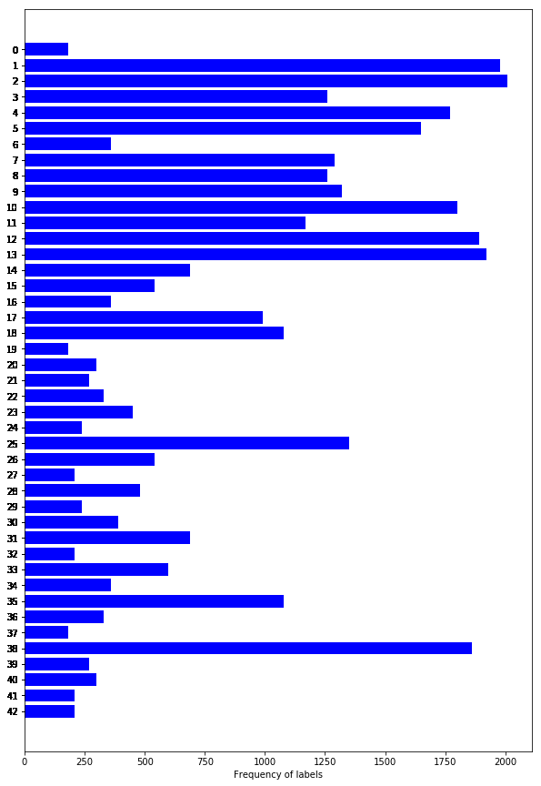
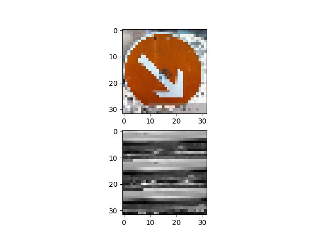
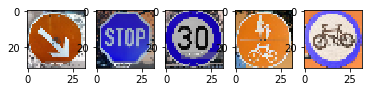

**Traffic Sign Recognition** 
**Traffic Sign Recognition Project**

Here is a link to my [project code](https://github.com/sanketgujar/CarND-Traffic-Sign-Classifier-Project/blob/master/Traffic_Sign_Classifier.ipynb)

**Data Set Summary & Exploration**
I used numpy, matplotlib and pandas to explore the dataset.
* The size of training set is 34799
* The size of the validation set is 4410
* The size of test set is 12630
* The shape of a traffic sign image is (32, 32, 3)
* The number of unique classes/labels in the data set is 43

**2. Here is an exploratory visualization of the data set.**
The training images in the dataset can be seen as below

The label distribution in training images can be visualized by the bargraph below

**Preprocessing**
As a first step, I decided to convert the images to grayscale to reuduc the amount of data, the grayscale image will train the netwrok faster than color images. Grayscale images will not affect the performance as most of the traffic signs have red color. 
Here is an example of a traffic sign image before and after grayscaling.As a last step, I normalized the image data to reduce skewness of images.

**2.Model Description**

My final model consisted of the following layers:

| Layer         		|     Description	        					| Input |Output| 
|:---------------------:|:---------------------------------------------:| :----:|:-----:|
| Input preprocessing   | 32x32x3 RGB image 	                           |**32x32x3**|32x32x1|
| Convolution 5x5     	 | 1x1 stride, valid padding, RELU            	  |32x32x1|28x28x48|
| Max pooling			        | 2x2 stride, 2x2 kernel						                  |28x28x48|14x14x48|
| Convolution 5x5 	     | 1x1 stride, valid padding, RELU            	  |14x14x48|10x10x96|
| Max pooling			        | 2x2 stride, 2x2 kernel	   					               |10x10x96|5x5x96|
| Convolution 3x3 		    | 1x1 stride, valid padding, RELU               |5x5x96|3x3x172|
| Max pooling			        | 1x1 stride, 2x2 kernel        				            |3x3x172|2x2x172|
| Flatten				           | flatten the matrix to 1D   					              |2x2x172| 688|
| FC                    | Fully connected layer                			      |688|84|
| FC                    | output = traffic sign labels in data        	 |84|**43**|

**Parameters**
To train the model, I used an my local machine CPU.

Training Parameters:

Batch size : 128

Epoch      : 15

Optimizer  : Adamoptimizer

Learning_rate: 0.001

Sigma_layers: 0.1

**Results**
My final model results were:
* training set accuracy of 99.0
* validation set accuracy of 93.2 
* test set accuracy of 92.4

I started with implementing Lenet first which gave me a validation test score of 89%, to improve the accuracy I added more convlutional layers and converted images to gray and normalized them, which gave me better result from the earlier model. Training for 15 epochs kept the accuracy fluctuating between (92 to 96), to prevent this we can add a filter which stops the training when the validation score begins to drop to avoid overfitting. I trained the network for 30 epochs but the maximum accuracy I got was 96.3%, but the training requires lot of time.  

**Testing Model on New Images**
Here are five German traffic signs that I found on the web:

Here are the results of the prediction:

| Image			        |     Prediction	        					| 
|:---------------------:|:---------------------------------------------:| 
| Keep Rigth      		| Keep Right   									| 
| Stop     			| Stop 										|
| 30 km/h 					| 30 km/h											|
| Priority road	      		| Priority road					 				|
| cycle road			| General caution      							|

The model was able to correctly guess 4 of the 5 traffic signs, which gives an accuracy of 80%. This compares favorably to the accuracy on the test set of 92.6.

For the first image, the model is relatively sure that this is a keep rigth (probability of 1.0), and the image does contain a stop sign. The top five soft max probabilities were

| Probability         	|     Prediction	        					| 
|:---------------------:|:---------------------------------------------:| 
| 1.00         			| Keep Right  									| 
| 1.00     				| Stop 										|
| 0.58					| 30Km/h											|
| 0.98	      			| Priority Road					 				|
| 0.83				    | General Caution     							|
